# **Đưa ứng dụng iOS lên AppStore**

Cocos Creator sau khi build cho iOS sẽ tạo ra 1 project dùng chung cho iOS và Mac, tương ứng với 2 `target` là `<name>-mobile` và `<name>-desktop` trong đó name là `Title` khi build project.

Ở đây ta chọn `<name>-mobile` để thiết lập.

## **Firebase**

File `GoogleService-Info.plist` được kéo vào project nằm ngay dưới thư mục gốc.

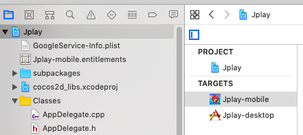

## **Tab General**

Mục `Identity` cho phép chỉnh sửa tên hiển thị, bundle id, tên phiên bản và mã bản build. (Nếu đẩy lỗi cần đẩy lại ta phải tăng bản build - ví dụ từ 1.0 lên 1.1, ... Nếu đẩy bản cập nhật ta phải tăng cả build và version - ví dụ 1.0.0 lên 1.0.1)

Mục `Signing` để mặc định là `Automatically manage signing`. Chọn tài khoản phát triển ở combobox Team.

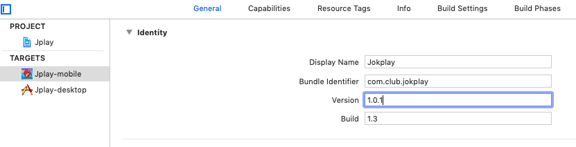

## **Tab Capabilities**

Tại mục `Background Modes` chọn `Remote notifications`

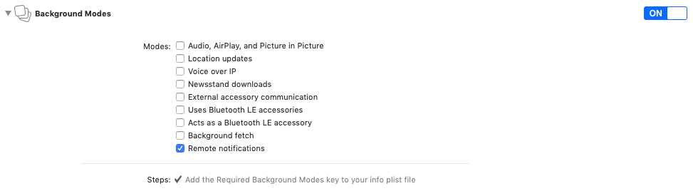

Tại mục `In-App Purchase` bật `ON`

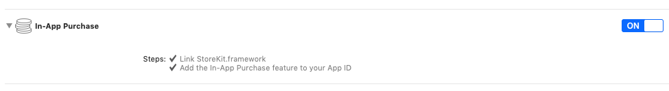

Tại mục `Push Notifications` bật `ON`

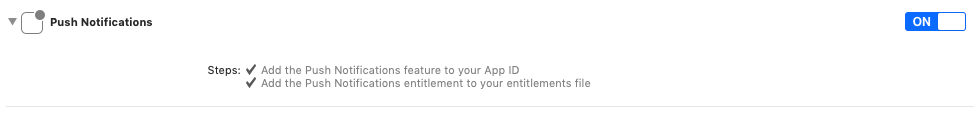

## **Tab Info**

Các thông tin ở đây có thể chỉnh dạng văn bản bằng cách vào thư mục `ios` chọn file `Info.plist` mở `Open As/Source Code`.

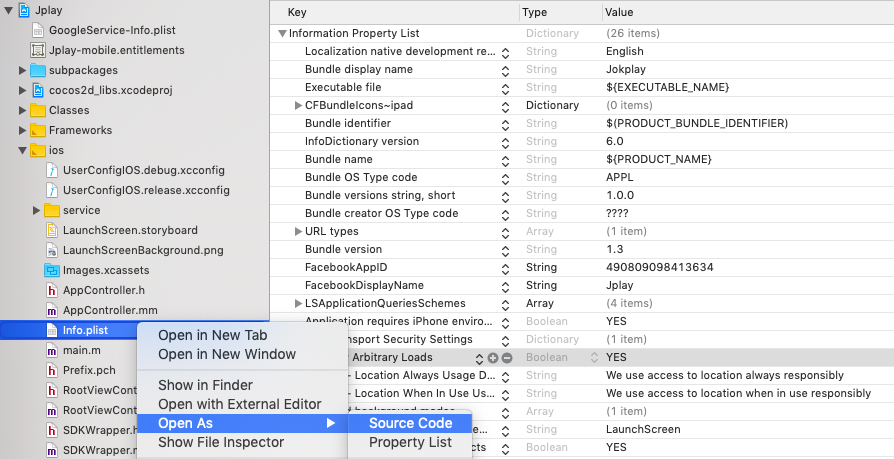

Thông tin `Facebook` như sau

```xml
<key>CFBundleURLTypes</key>
<array>
    <dict>
        <key>CFBundleURLSchemes</key>
        <array>
            <string>fb490809098413634</string>
        </array>
    </dict>
</array>
<key>FacebookAppID</key>
<string>490809098413634</string>
<key>FacebookDisplayName</key>
<string>Jplay</string>
<key>LSApplicationQueriesSchemes</key>
<array>
    <string>fbapi</string>
    <string>fb-messenger-share-api</string>
    <string>fbauth2</string>
    <string>fbshareextension</string>
</array>
```

Tránh cảnh báo thiếu mô tả `Location Permission`

```xml
<key>NSLocationAlwaysUsageDescription</key>
<string>We use access to location always responsibly</string>
<key>NSLocationWhenInUseUsageDescription</key>
<string>We use access to location when in use responsibly</string>
```

## **Đẩy bản build lên Itunnes Connect**

Chọn build app với `Generic iOS Device` lúc này trên Xcode, menu `Product` sẽ cho phép menu con `Archive` hoạt động. Nhấn vào `Archive` để đóng gói bản build.

Sau khi Xcode đóng gói sẽ hiện giao diện sau:

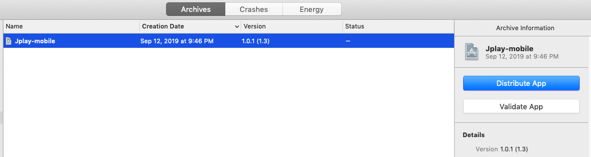

Nhấn `Validate App` để kiểm tra hoặc `Distribute App` để đưa lên iTunnes Connect. Nên kiểm tra trước khi đẩy để đỡ mất công đẩy lại.

Nếu chọn `Distribute App` ta để mặc định option `iOS App Store` và nhấn `Next`.

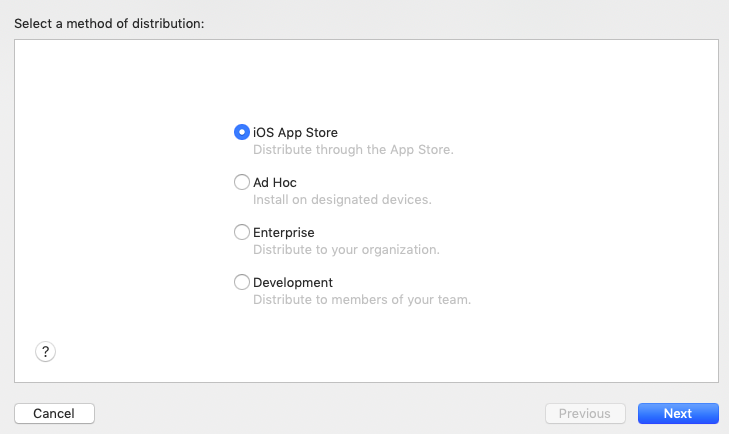

Để mặc định `Upload` và nhấn `Next`

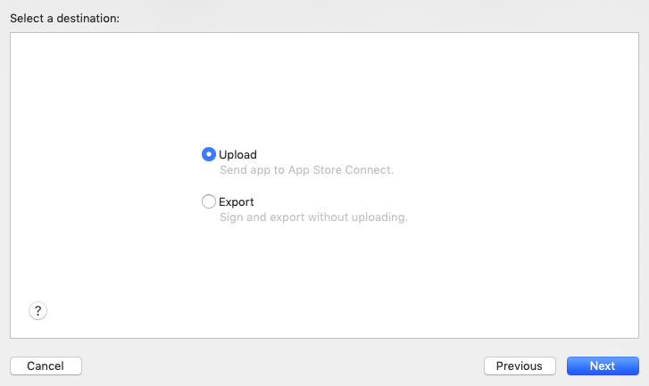

Để mặc định và nhấn `Next`

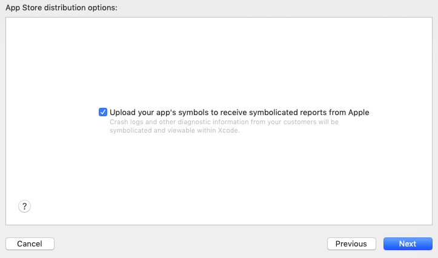

Để mặc định `Automatically manage signing` và nhấn `Next`

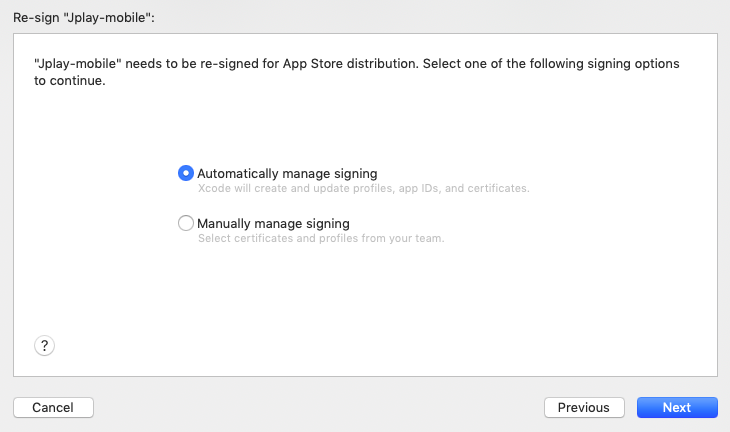

Nhấn `Upload`

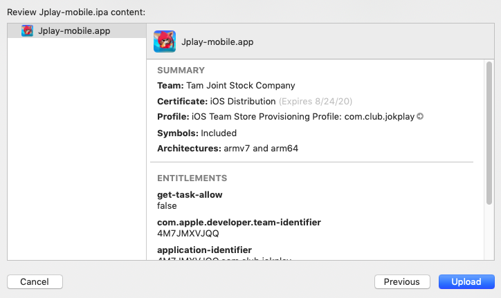

Đợi Xcode đưa file .ipa lên iTunnes Connect và thông báo thành công.

## **Submit ứng dụng**

Đăng nhập vào iTunnes Connect, chọn `My Apps` chọn game. Click vào `VERSION OR PLATFORM`, nhấn `Create`.

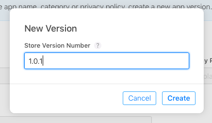

Điền đầy đủ các thông tin Apple yêu cầu.

Vào tab `Activity` kiểm tra xem bản build đã được xử lý xong chưa, đôi khi quá trình này xảy ra khá lâu 1,2 tiếng.

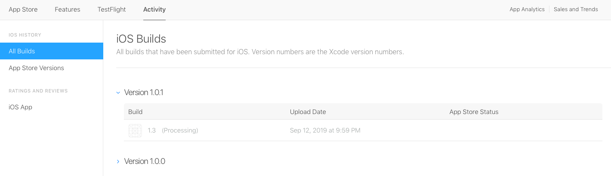

Nếu xong rồi thì quay lại tab `App Store` tại mục `Build` nhấn vào dấu (+) để chọn bản build. Nhấn `Done`.

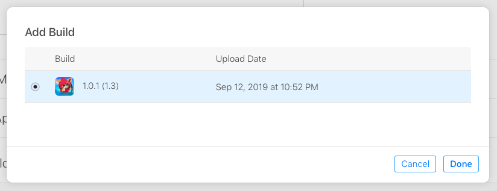

Nhấn `Save` và sau đó là `Submit for Review`.

Mục `Export Compliance` chọn `No`.

Mục `Advertising Identifier` chọn như sau:

* **Does this app use the Advertising Identifier (IDFA)?** `Yes`
* **Serve advertisements within the app** `không chọn`
* **Attribute this app installation to a previously served advertisement** `chọn`
* **Attribute an action taken within this app to a previously served advertisement** `chọn`
* **Limit Ad Tracking setting in iOS** `chọn`

Nhấn `Submit`.
