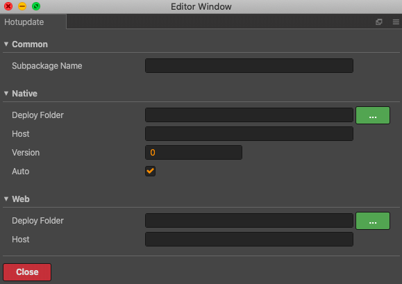

# **Subpackages**

* [**Yêu cầu**](#Yêu-cầu)
* [**Thảo luận**](#Thảo-luận)
* [**Phân tích**](#Phân-tích)
* [**Giải pháp**](#Giải-pháp)
    * [**main.js**](#main.js)
    * [**GGame.js**](#GGame.js)
    * [**GLoadGame.js**](#GLoadGame.js)
* [**Thứ tự thực hiện**](#Thứ-tự-thực-hiện)
* [**Source code**](#Source-code)
* [**Extension**](#Extension)

## **Yêu cầu**

Đọc trước phần [hotupdate](./hotupdate.md) để nắm được cơ chế khởi tạo tài nguyên của Cocos Creator.

## **Thảo luận**

Ở phần `hotupdate` ta thấy `subpackage` là một giải pháp hiệu quả đối với nền tảng native, phần này sẽ xem xét triển khai `subpackage` trên nền tảng web để giảm tải tài nguyên.

Cocos Creator chỉ hỗ trợ `subpackage` cho các mini game dạng WeChat Mini Games, OPPO Mini Games, ...  và có giới hạn.

Đối với WeChat Mini Games: 
* Kích thước của tất cả các `subpackage` của toàn bộ ứng dụng không thể vượt quá 8M.
* Kích thước của một `subpackage` / main package không thể vượt quá 4M.

Đối với web desktop hoặc web mobile thì không được hỗ trợ.

## **Phân tích**

Xem xét cấu trúc `index.html` trong thư mục `build`/`web-dekstop` của nền tảng web.

```html

<script src="src/settings.js" charset="utf-8"></script>
<script src="main.js" charset="utf-8"></script>

<script type="text/javascript">
(function () {
    // open web debugger console
    if (typeof VConsole !== 'undefined') {
        window.vConsole = new VConsole();
    }

    var splash = document.getElementById('splash');
    splash.style.display = 'block';

    var cocos2d = document.createElement('script');
    cocos2d.async = true;
    cocos2d.src = window._CCSettings.debug ? 'cocos2d-js.js' : 'cocos2d-js-min.js';

    var engineLoaded = function () {
        document.body.removeChild(cocos2d);
        cocos2d.removeEventListener('load', engineLoaded, false);
        window.boot();
    };
    cocos2d.addEventListener('load', engineLoaded, false);
    document.body.appendChild(cocos2d);
})();
</script>

</body>
</html>
```

Nhận thấy: 
* File `settings.js` được load ngay trước `main.js` 
* Khi web đã tải xong hàm `window.boot()` sẽ được gọi.
* Hàm `window.boot()` dùng chung cho cả native và web. Đây là phần cho thấy có thể tái sử dụng mã của hotupdate.

Dựa theo cách của hotupdate trên native ta sẽ điều chỉnh các giá trị cho phù hợp với web.

## **Giải pháp**

### **main.js**

Ta sẽ lưu lại giá trị settings của ứng dụng chính như sau: Tạo thư mục `web-desktop` trong `build-templates` với mã bổ sung ngay dưới `window.boot();`

```js
// ...
    window.boot();
} else {
    window['settings'] = window._CCSettings;
}
```

### **GGame.js**

Trong phần hotupdate đường dẫn khởi tạo settingScript đã được chỉ định tường minh `var pathSetting = path + '/src/' + settingScript;`, nhưng đường dẫn cho `bundledScript` cũng như `libraryPath` và `rawAssetsBase` của hàm `cc.AssetLibrary.init` đang để ngầm định là domain của chính trang web (Trên native: dựa vào searchPaths mặc định của Cocos Creator để tìm kiếm tài nguyên). Cần chỉ định đường dẫn này để trỏ đến các link cần thiết thay vì mặc định.

```js
window.bootSubGame = function (path, settings, bundledScript) { // add path

// ...

// jsList
var jsList = settings.jsList;
if (jsList) {
    jsList = jsList.map(function (x) {
        return 'src/' + x;
    });
    jsList.push(path + bundledScript); // add path
}
else {
    jsList = [path + bundledScript]; // add path
}
```

Gọi `bootSubGame` với tham số `path` là `path + '/'`.

```js
window.bootSubGame(path + '/', window[scriptId], 'src/' + bundledScript);
```

Đoạn khởi tạo assets nếu `libraryPath` và `rawAssetsBase` sửa thành `libraryPath: path + 'res/import'` và `rawAssetsBase: path + 'res/raw-'` sẽ lấy được tài nguyên của `subpackage` nhưng do không có searchpaths như native nên từ đường dẫn mặc định `path` của `subpackage` không có cách nào tải được tài nguyên của ứng dụng chính.

```js
cc.AssetLibrary.init({
    libraryPath: 'res/import',
    rawAssetsBase: 'res/raw-',
    rawAssets: settings.rawAssets,
    packedAssets: settings.packedAssets,
    md5AssetsMap: settings.md5AssetsMap
});
```

Do vậy cần giữ nguyên mã khởi tạo assets và xử lý bằng cách lưu tất cả các file trong thư mục `res` của các `subpackage` cùng thư mục `res` với ứng dụng chính (thư mục `src` vẫn phân tách theo `subpackage`). Sử dụng mã [copy.js](./src/subpackage/copy.js) để sao chép (xem chi tiết ở mục [Thứ tự thực hiện](#Thứ-tự-thực-hiện)).

### **GLoadGame.js**

Vai trò của `GLoadGame.js` trong trường hợp này chỉ là khởi tạo thông tin `subpackage`, sau đó chuyển cho `GGame.js` đóng vai trò tải và chạy `subpackage`. Cần thêm đường dẫn để phân biệt native với web khi dùng chung mã.

```js
const HOT_UPDATE_URL = '';
const HOT_UPDATE_URL_WEB = '';

// ...

createInfo(spriteFrame, info) {
    // ...

    if (cc.sys.isBrowser) {
        const path = `${HOT_UPDATE_URL_WEB}/${info.id}/assets`;
        window.runSubGame(path, `settings.${info.id}.js`, `project.${info.id}.js`);
        return;
    }

    this.updateGame(info.id);
}
```

_Lưu ý:_
* Cocos Creator dựa trên `uuid` để xác định các đối tượng nên tránh việc copy & paste giữa các project, nếu trùng `uuid` mã sẽ không chạy đúng nữa.
* Bản web cần build `MD5 Cache` để tránh trình duyệt cache tài nguyên.
* Để kiểm soát được tên `settings.js` và `project.js` (không phải sửa mã ứng dụng chính mỗi khi build `Md5 Cache`) ta xoá phần md5 trong tên sau khi build và sửa lại như bản native `settings.id.js`, `project.id.js`. 
* Do tên `settings.id.js`, `project.id.js` đã xoá md5 nên sẽ bị trình duyệt cache, để tránh cache ta thêm 1 giá trị ngẫu nhiên vào cuối như sau:
    ```js
    if (cc.sys.isBrowser) {
        const path = `${HOT_UPDATE_URL_WEB}/${info.id}/assets`;
        window.runSubGame(path,
            `settings.${info.id}.js?r=` + (new Date()).getTime() + Math.random(),
            `project.${info.id}.js?r=` + (new Date()).getTime() + Math.random());
        return;
    }
    ```
* Để kiểm tra `bundledScript` trong trường hợp gọi layer không phải scene ta cần sửa lại đoạn kiểm tra `bundledScript` (do lúc này đã chứa thêm giá trị ngẫu nhiên `r`)
    
    ```js
    cc.director.off('hotupdate');
    cc.director.on('hotupdate', function (event) {
        if (event.code == 0 || event.code == -1) {
            return;
        }

        if (event.code == 1) {
            if (event.bundledScript.indexOf('src/project.1.js') == 0) {
                //if (event.bundledScript == 'src/project.1.js') {
                cc.loader.loadRes('prefabs/game1', function (err, prefab) {
                    var newNode = cc.instantiate(prefab);
                    cc.director.getScene().addChild(newNode);
                });
            }
        }
    }.bind(this));
    ```

## **Thứ tự thực hiện**
* Build main application ra `web-desktop` (thay bằng đường dẫn tương ứng nếu là `web-mobile`), sau đó chạy lệnh copy thư mục `web-desktop` vào thư mục `build`
    ```sh
    node copy -s ./<main application>/build/web-desktop -d ./build
    ```
* Build subpackage 1, sau đó chạy lệnh copy thư mục `res` của subpackage 1 vào thư mục `build/web-desktop`
    ```sh
    node copy -s ./<subpackage 1>/build/web-desktop/res -d ./build/web-desktop
    ```
* Tạo thư mục subpackage 1 trong thư mục `build`, tạo thư mục `assets` trong subpackage 1, copy thư mục `src` của subpackage 1 vào `build/<subpackage 1>/assets`.

* Tương tự cho các subpackage khác. 

**Cấu trúc thư mục build trên server**

```
+ build
|   + web-desktop
|   |   + res
|   |   |   ... (res gate + res subpackage 1 + ...)
|   |   + src
|   + 1 (subpackage 1)
|   |   + assets
|   |   |   + src
|   |   |   |   - project.1.js
|   |   |   |   - settings.1.js
...
```
Xem mục [extension](#extension) để tự động quy trình thực hiện.

## **Source code**

* File script sao chép các file `res` [copy.js](./src/subpackage/copy.js)
* File build-templates [main.js](./src/build-templates/web-desktop/main.js)
* File tải và chạy `subpackage` [GGame.js](./src/subpackage/GGame.js)
* File khởi tạo thông số `subpackage` [GLoadGame.js](./src/subpackage/GLoadGame.js)

## **Extension**

Các thao tác của phần thực hiện ở trên gồm nhiều bước dễ nhầm lẫn, cách tốt hơn là tự động các bước bằng cách xây dựng 1 extension bắt sự kiện build finish của Cocos Creator để xử lý. Nếu sử dụng extension này thì sẽ không cần quan tâm mục [Thứ tự thực hiện](#Thứ-tự-thực-hiện), file [copy.js](./src/subpackage/copy.js), file build-templates [main.js](./src/build-templates/web-desktop/main.js) và file [version_generator.js](./src/version_generator.js) (đối với native).

Copy thư mục `sbweb` vào thư mục `packages` của ứng dụng gate và các subpackage.

```
+ app
|   + assets
|   + build
|   + library
|   + local
|   + packages (thư mục chứa các extension)
|   + settings
|   + temp
```

Mở project gate hoặc subpackage vào menu `Extension\Hotupdate` của Cocos Creator cập nhật thông số vào giao diện sau.



* `Deploy Folder`: thư mục đích copy bản build của gate và res của subpackage (Bấm vào nút xanh để chọn). Đây là thư mục chứa toàn bộ resource và code cần triển khai trên web.
* `Host`: link server của bản web để sinh phiên bản hotupdate. Đây là giá trị `HOT_UPDATE_URL_WEB` trong [GLoadGame.js](./src/subpackage/GLoadGame.js).
* `Subpackage Name`: Tên subpackage, mặc định trống là gate.
* `Version`: Phiên bản hotupdate. (Đối với native)
* `Auto`: Chế độ tăng tự động phiên bản. (Đối với native)

Sau khi thiết lập xong đóng panel để cập nhật các thay đổi và thực hiện build ứng dụng bình thường với thứ tự gate trước, các subpackage sau. Sau khi build thành công copy thư mục `Deploy Folder` lên server triển khai web.

Để giảm thiểu các sai sót sau khi build, extension `sbweb` sẽ tự động các bước dưới đây cho người dùng:
* Thêm lệnh `window['settings'] = window._CCSettings;` vào file `main.js` mà không cần template.
* Bỏ tên md5 của các file trong thư mục `src` gốc thành tên theo quy ước.
    * `project.<md5>.js` thành `project.<subpackage name>.js`
    * `settings.<md5>.js` thành `settings.<subpackage name>.js`
* _Sinh ra file manifest dựa theo `host` và `version` đã khai báo. (đối với native)_
* _Tự động tăng `version` nếu chọn chế độ `auto`. (đối với native)_
* Copy `res` có md5 vào thư mục đích `Deploy Folder\web-desktop\res` hoặc `Deploy Folder\web-mobile\res`.
* Xoá và tạo thư mục `Deploy Folder\<subpackage name>`.
* Copy `src` bỏ md5 vào thư mục đích `Deploy Folder\<subpackage name>\assets`.
* Move các file manifest vào thư mục đích `Deploy Folder\<subpackage name>\assets`.
* Phục hồi lại tên `project.<md5>.js` và `settings.<md5>.js` tại thư mục gốc.
