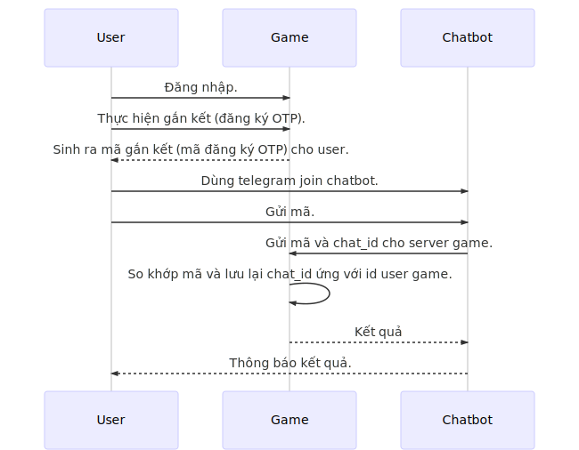

# **Sử dụng chatbot**

Mục đích xác thực tài khoản qua chatbot nhằm lấy được định danh trên kênh chat phục vụ các mục đích gửi thông tin tới user.

## **1. Sequence diagram**



## **2. Đăng ký chatbot**

* Sử dụng link `https://t.me/botfather` để chat với BotFather.
* Dùng lệnh `/newbot` để tạo chatbot.
* Nhập tên hiển thị chatbot.
* Nhập tên liên hệ có kết thúc bằng `bot`. (Ví dụ: tetris_bot).

Sau khi đăng ký thành công BotFather sẽ gửi về thông tin access token.

## **3. Tạo web chatbot**

### **3.1. Tạo webhook**

Link để nhận dữ liệu postback từ Telegram phải là domain có chứng chỉ (https)

```
https://api.telegram.org/bot<token>/setwebhook?url=https://yourdomain.com/bothook
```

Kết quả

```json
{
    "ok": true,
    "result": true,
    "description": "Webhook was set"
}
```

*Lưu ý: Link nhận postback phải trả về kết quả khi được gọi `{ ok: true }`*

### **3.2. Kiểm tra webhook**

```
https://api.telegram.org/bot<token>/getWebhookInfo
```

Kết quả

```json
{
    "ok": true,
    "result": 
    {
        "url": "https://<your domain>/bothook",
        "has_custom_certificate": false,
        "pending_update_count": 16,
        "last_error_date": 1563879213,
        "last_error_message": "Read timeout expired",
        "max_connections": 40
    }
}
```

### **3.3. Lấy thông tin user**

Telegram sẽ post dữ liệu về link webhook đã đăng ký, khi user chat với chatbot ta sẽ nhận được toàn bộ thông tin chat này có định dạng như sau:

```
{
    "update_id": 993865171,
    "message":
        {
            "message_id": 76,
            "from":
                {
                    "id": 536658379,
                    "is_bot": false,
                    "first_name": "",
                    "last_name": "",
                    "username": "",
                    "language_code": "en"
                },
            "chat":
                {
                    "id": 536658379,
                    "first_name": "",
                    "last_name": "",
                    "username": "",
                    "type": "private"
                },
            "date": 1563934315,
            "text": "Hi"
        }
}
```

Ở đây:

* `message.chat.id` là chat_id
* `message.chat.username` là username của user gửi tin nhắn
* `message.text` là nội dung tin nhắn

### **3.4. Gửi tin nhắn**

GET

```
https://api.telegram.org/bot<token>/sendMessage?chat_id=<chat_id>&text=hello
```

POST

```
https://api.telegram.org/bot<token>/sendMessage

Content-Type: 'application/json'

data post: 
{
    chat_id: chatid,
    text: `hello ${username} 👋`,
    parse_mode: 'HTML',
    disable_web_page_preview: false,
    disable_notification: false
}
```

### **3.5. Lấy số điện thoại**

1. Show keyboard lấy số điện thoại

```js
{
    chat_id: chatId,
    text: 'How can we contact you?',
    parse_mode: 'HTML',
    disable_web_page_preview: false,
    disable_notification: false,
    reply_markup: {
        one_time_keyboard: true,
        keyboard: [[{
            text: 'My phone number',
            request_contact: true
        }], ['Close']]
    }
}
```

2. Lấy kết quả trả về

```json
{
    "update_id": 993865193,
    "message":
    {
        "message_id": 126,
        "from":
        {
            "id": 536658379,
            "is_bot": false,
            "first_name": "",
            "last_name": "",
            "username": "",
            "language_code": "en"
        },
        "chat":
        {
            "id": 536658379,
            "first_name": "",
            "last_name": "",
            "username": "",
            "type": "private"
        },
        "date": 1563942851,
        "contact":
        {
            "phone_number": "xxxxxxxxxx",
            "first_name": "",
            "last_name": "",
            "user_id": 536658379
        }
    }
}
```

* `message.chat.id` là chat_id
* `message.contact.phone_number` là số điện thoại cần lấy
* `message.contact.user_id` là user id

3. Đóng keyboard

```js
{
    chat_id: chatid,
    text: 'Thank you!',
    reply_markup: {
        remove_keyboard: true
    }
}
```